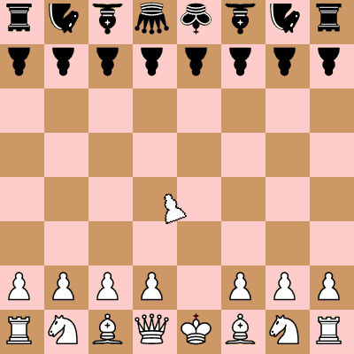

# Rotating Chess

A very normal game of chess.

Check out the example game in `/dist_assets/example_game`.

### attributions

chess pieces from: https://opengameart.org/content/chess-pieces-and-a-board

and https://commons.wikimedia.org/wiki/Category:SVG_chess_pieces

### rules

The program allows the movement and rotation of any piece at any time.

The following ruleset is currently recommended:
- alternating player turns, starting with white
- on each turn, the player must move a piece and may rotate a piece, in that order
- pawns, knights, and kings may "jump" over other pieces. all other pieces may be "blocked"
- pawns always have access to their two-forward movement

### technical details

This pygame game is developed on Python 3.10.12. There is a `__future__` import for type checking in `moveselector.py`. 

Start the game by calling `python3 game.py`.

Colors and some other settings may be edited with a text editor via `settings.py`.
